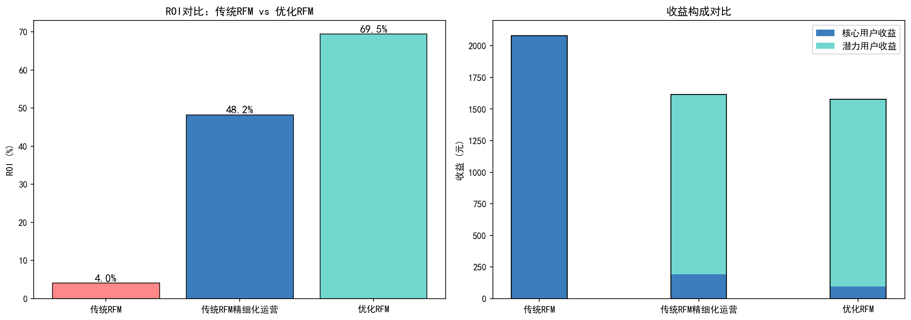
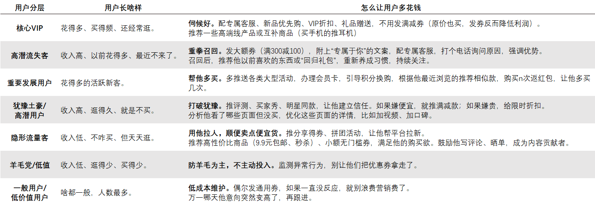

# 电商用户分层与营销策略
# 项目说明
1. **代码查看与运行**  
&emsp;&emsp;所有数据处理、指标构建、用户分层、可视化、ROI 测算的完整代码均在文件**电商用户分层与营销策略.ipynb**，点开该文件即可看到全部代码以及运行结果。
2. **可视化结果和营销策略**  
&emsp;&emsp;所有图片均可在文件夹**images** 中查看，包括分布分析、相关性分析、用户分层、ROI对比等可视化图片。
3. **用户分群明细**   
&emsp;&emsp;完整的用户分群明细整理在文件**用户分群.xlsx**。
# 项目背景与数据说明
1. **项目背景**  
&emsp;&emsp;电商平台用户规模大，用户分层是精准营销的基础，传统RFM模型依赖消费数据，忽略用户意向度和收入背景，无法识别高意向低转化、高收入低消费等潜力用户。  
&emsp;&emsp;为实现精细化运营、提高营销效率，本项目对传统 RFM 进行优化，构建用户分层体系。
2. **数据说明**  
&emsp;&emsp;本项目使用Kaggle网站上公开的电商平台用户数据集，共包含**1000条用户记录，14个字段**，覆盖三类数据如下：  
- **用户画像**：User_ID, Age, Gender, Location, Income, Interests, Newsletter_Subscription
- **消费数据**：Last_Login_Days_Ago, Purchase_Frequency, Average_Order_Value, Total_Spending, Product_Category  
- **行为数据**：Time_Spent_on_Site_Minutes, Pages_Viewed 

# 项目内容
1. **数据预处理与探索性分析**  
&emsp;&emsp;本项目使用的数据集质量很好，无缺失值、重复值与异常值，数据清洗后进行数据探索性分析。
- **数据清洗**：无缺失值、重复值与异常值；
- **分布分析**：绘制消费金额、用户意向度分布直方图，以及收入分层下的收入-消费散点图；
- **相关性分析**：构建指标相关性矩阵。

  &emsp;&emsp;在数据探索的过程中，发现了两个问题。第一个问题是**网站停留时间、浏览页数与购买频率、消费金额的相关系数接近于零**，这意味着用户逛得久和买得多之间没有相关性，存在着这样一类高意向度的潜力用户等待挖掘，而这类用户在传统 RFM 模型中却会由于购买频率、消费金额不够高而被归类为低价值用户。第二个问题是**高收入人群中，54.1%的人消费低于平均水平**，这类人群有钱但不在平台消费，同样是值得重点营销的对象。  

2. **指标重构与模型优化**  
&emsp;&emsp;基于以上数据探索，新增两个指标：
- **意向度指标(I_Score)**：对网站停留时间、浏览页数加权计算，量化用户购买意愿；
- **收入分层(Income_Level)**：按收入分位数将用户划分为低、中、高三个收入群体，反映用户消费能力。

  &emsp;&emsp;在用RFM模型进行基础分层的基础上，使用以上两个指标对其进行修正，识别出传统RFM无法发现的用户，最终将用户划分7类，并生成用户分层雷达图和分布柱状图，同时导出按用户分层分Sheet的用户分群表格，可用于后续触达。

3. **ROI测算**  
&emsp;&emsp;为了验证优化RFM模型的业务价值，设计对比试验，比较不同方案在相同预算下的营销效果。
通过设定预算、优惠券成本、转化率等业务参数，量化对比了以下3种运营策略：
- **方案A**：传统 RFM 策略（RFM 前 20% 用户）
- **方案B**：传统 RFM 精细化运营（核心 + 潜力用户）
- **方案C**：优化 RFM 策略（核心 + 潜力用户）

# 项目结果
1. **ROI测算结果**  
  　　ROI测算结果如下图所示。可以看出，传统RFM模型，对比精细化运营和非精细化运营，ROI从4.0%提升至48.2%，证明精细化运营能极大程度上减少无效投入，提升营销效率。
   而优化RFM模型能够更精准的找到高价值人群，总收益虽然小幅减少，但ROI 从48.2%提升至69.5%，充分证明了优化 RFM 模型的业务价值。
   
2. **用户分层和营销策略**  
  　　基于优化后的RFM模型，最后的用户分层如下表所示，并针对不同群体给出了差异化运营策略。
   

   
   
